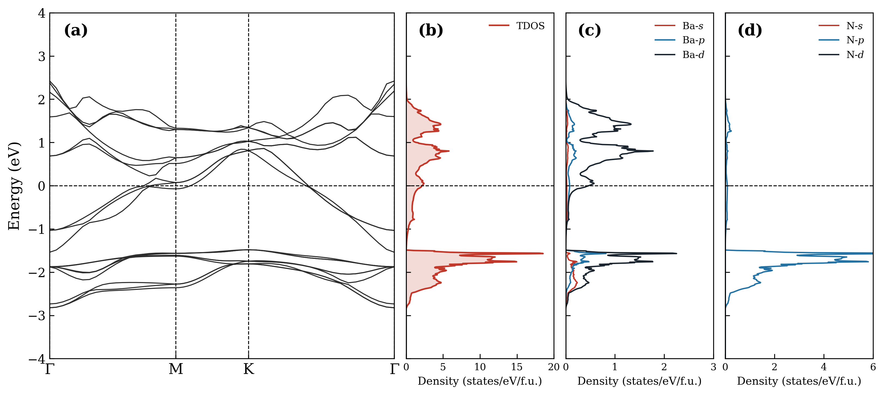

# Ba2N Electronic Structure Calculations

本项目为 Ba₂N 的第一性原理计算报告及相关文件，使用 VASP 完成。

## 计算内容

1. 结构优化（Structural Relaxation）
2. 能带结构与态密度（Band Structure & DOS）
3. 电子局域函数（Electron Localization Function, ELF）
4. 部分电荷密度（Partial Charge Density, PCD）

详细计算方法、INCAR 参数设置及后处理脚本见 [`report/Ba2N_计算报告.pdf`](report/Ba2N_计算报告.pdf)。

## 结构信息

- 化学式：Ba₂N
- 空间群：R-3m（反CdCl₂型层状结构）
- 晶格参数：a = 4.046 Å，c = 23.025 Å
- 超胞：Ba₆N₃（3 formula units）

## 赝势

见 [`POTCAR.info`](POTCAR.info)，使用 PBE 泛函，Ba_sv + N。

## 结果预览

| Band & DOS | ELF | PCD |
|:---:|:---:|:---:|
|  |  |  |

## 计算流程
01_relax → 02_scf → 03_band / 04_dos / 05_elf / 06_pcd

## 软件环境

- VASP 5.x
- vaspkit（后处理）
- Python 3.x，matplotlib，pymatgen（绘图）

## License

MIT License
